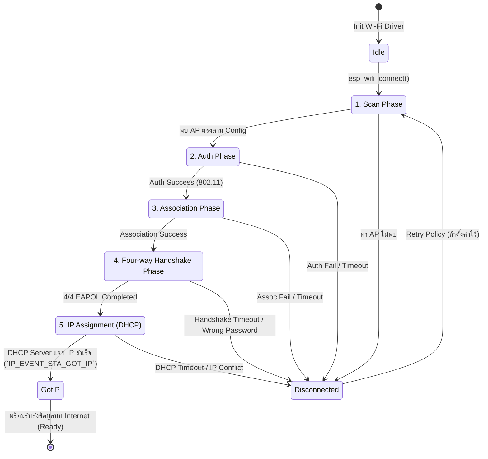

# สถาปัตยกรรมและขั้นตอนย่อยในการเชื่อมต่อ Wi-Fi ของ ESP32

ในการพัฒนาแอปพลิเคชัน IoT บน ESP32 การเข้าใจกระบวนการสถาปนาการเชื่อมต่อไร้สาย (Wi-Fi Connection Lifecycle) ถือเป็นพื้นฐานสำคัญอย่างยิ่ง เมื่อเราสั่งให้ ESP32 เชื่อมต่อกับ Access Point (AP) ไดรเวอร์ Wi-Fi ของ ESP32 จะไม่ได้เชื่อมต่อทันทีในขั้นตอนเดียว แต่จะดำเนินงานผ่าน **เฟสย่อย (Sub-phases)** ตามมาตรฐาน IEEE 802.11 และกระบวนการขอ IP Address ผ่าน TCP/IP Stack

---

## 0. บทบาททาง Hardware และประเภทข้อมูลในระบบ (Hardware Roles & Taxonomy)

ก่อนที่จะเข้าสู่ขั้นตอนการสื่อสาร ผู้เรียนควรแยกแยะบทบาทของอุปกรณ์และโปรโตคอลออกเป็น 3 ส่วนหลัก:

1. **Hardware / Device Role (อุปกรณ์และบทบาทในระบบ)**:
   - **Access Point (AP)**: อุปกรณ์แม่ข่าย/จุดเชื่อมต่อไร้สาย (เช่น Wi-Fi Router) ทำหน้าที่กระจายสัญญาณ ประกาศตัวตน และจัดสรรทรัพยากร
   - **Station (STA)**: อุปกรณ์ลูกข่ายที่ขอเชื่อมต่อเข้ากับ AP (ในที่นี้คือไมโครคอนโทรลเลอร์ **ESP32**, สมาร์ตโฟน, หรือโน้ตบุ๊ก)
2. **Protocol & Standard (ข้อกำหนดและกฎเกณฑ์การสื่อสาร)**:
   - **IEEE 802.11**: มาตรฐานการสื่อสาร Wi-Fi ระดับ Physical (PHY) และ Link Layer (MAC)
   - **WPA2 / WPA3 & EAPOL**: โปรโตคอลแลกเปลี่ยนคีย์ความปลอดภัย
   - **TCP/IP & DHCP**: โปรโตคอลการรับส่งข้อมูลและการจัดสรร IP Address ในระดับ Layer 3
3. **Data / Frame & Key (ข้อมูลที่ส่งผ่านคลื่นวิทยุ)**:
   - **Identifiers**: SSID (ชื่อ Wi-Fi), BSSID (MAC ของ AP), MAC Address (ประจำเครื่อง ESP32)
   - **Management Frames**: Beacon Frame, Probe Request/Response, Auth Frame, Assoc Frame
   - **Encryption Keys**: PSK (รหัสผ่าน), PMK, PTK, GTK

---

## 1. แผนผังลำดับขั้นตอนการทำงาน (Wi-Fi Connection State Machine)

กระบวนการเชื่อมต่อทั้งหมดสามารถสรุปเป็น State Diagram ได้ดังนี้:



---

## 2. สรุปรายละเอียดของทั้ง 5 เฟสหลัก

| เฟสย่อย | คำอธิบายสั้น | สัญญาณตอบรับสำเร็จ (Success Event) | Event/Reason เมื่อล้มเหลว |
| :--- | :--- | :--- | :--- |
| **1. Scan Phase** | ไดรเวอร์ทำการสแกนหา SSID/BSSID ตามที่กำหนดใน Configuration | พบ AP Target ที่มีสัญญาณ | `WIFI_EVENT_STA_DISCONNECTED` (NO_AP_FOUND) |
| **2. Auth Phase** | เริ่มขั้นตอนตกลงสิทธิ์ (Authentication) ระหว่าง ESP32 กับ AP ในระดับ Link Layer | AP ตอบรับ Auth Frame | `WIFI_REASON_AUTH_EXPIRE` / `WIFI_REASON_AUTH_FAIL` |
| **3. Association Phase** | ส่งคำร้องขอผูกสัมพันธ์ (Association Request) เพื่อตกลง Capability และ Data Rates | AP ตอบรับ Association Response | `WIFI_REASON_ASSOC_EXPIRE` / `WIFI_REASON_ASSOC_FAIL` |
| **4. Four-way Handshake** | ทำการแลกเปลี่ยนคีย์ความปลอดภัย WPA2/WPA3 (EAPOL 1/4 ถึง 4/4) | `WIFI_EVENT_STA_CONNECTED` | `WIFI_REASON_HANDSHAKE_TIMEOUT` |
| **5. IP Assignment (DHCP)** | ขอหมายเลข IP Address, Subnet Mask, Gateway จาก DHCP Server บน AP | `IP_EVENT_STA_GOT_IP` | DHCP Timeout / Lease Failed |

---

## 3. สถาปัตยกรรม ESP-IDF Event Loop Architecture

การทำงานของ Wi-Fi บน ESP32 ขับเคลื่อนด้วยระบบ **Event-driven** ผ่าน `esp_event` loop ซึ่งแยกเป็น 2 กลุ่ม Event หลัก:

1. **`WIFI_EVENT`**: เกิดจาก Wi-Fi Driver ในระดับ H/W และ Link Layer (เช่น `STA_START`, `STA_CONNECTED`, `STA_DISCONNECTED`)
2. **`IP_EVENT`**: เกิดจาก TCP/IP Stack (lwIP) ในระดับ Network Layer (เช่น `STA_GOT_IP`, `STA_LOST_IP`)

### ตัวอย่างโครงสร้างโค้ดการจัดการ Event (Event Handler Concept)

```c
// ตัวอย่างโค้ดในรูปแบบ ESP-IDF C Conceptual Code
static void wifi_event_handler(void* arg, esp_event_base_t event_base,
                               int32_t event_id, void* event_data) 
{
    if (event_base == WIFI_EVENT && event_id == WIFI_EVENT_STA_START) {
        esp_wifi_connect(); // เริ่มต้นกระบวนการ Scan & Connect
    } 
    else if (event_base == WIFI_EVENT && event_id == WIFI_EVENT_STA_CONNECTED) {
        printf("Wi-Fi Link Layer Connected! Waiting for IP...\n");
    } 
    else if (event_base == WIFI_EVENT && event_id == WIFI_EVENT_STA_DISCONNECTED) {
        wifi_event_sta_disconnected_t* event = (wifi_event_sta_disconnected_t*) event_data;
        printf("Disconnected! Reason code: %d\n", event->reason);
    } 
    else if (event_base == IP_EVENT && event_id == IP_EVENT_STA_GOT_IP) {
        ip_event_got_ip_t* event = (ip_event_got_ip_t*) event_data;
        printf("Got IP Address: " IPSTR "\n", IP2STR(&event->ip_info.ip));
    }
}
```

---

## 4. คำถามทบทวนความเข้าใจ (Checkpoints)

1. **เหตุใดการเกิด Event `WIFI_EVENT_STA_CONNECTED` จึงยังไม่เพียงพอที่จะเริ่มส่งข้อมูลไปยังเว็บเซิร์ฟเวอร์ภายนอกได้?**
   - **ตอบ:** เพราะ Event `WIFI_EVENT_STA_CONNECTED` เป็นเพียงการยืนยันความสำเร็จในระดับ Link Layer (Layer 2) และการจับคู่สำเร็จผ่าน Four-way Handshake เท่านั้น ESP32 ในขณะนั้นเพิ่งจะเชื่อมต่อเข้ากับวงแลนไร้สาย (Access Point) ได้สำเร็จ แต่ **ยังไม่มีหมายเลข IP Address (Layer 3)** เป็นของตัวเอง จึงยังไม่สามารถจัดแพ็กเก็ตส่งข้อมูลผ่านโปรโตคอล TCP/IP ไปยังเครือข่ายภายนอกหรืออินเทอร์เน็ตได้ จำเป็นต้องรอให้ผ่านกระบวนการ DHCP และได้รับ Event `IP_EVENT_STA_GOT_IP`เสียก่อน

2. **หากพิมพ์รหัสผ่าน Wi-Fi ผิด กระบวนการเชื่อมต่อจะหลุดและแจ้ง Error ในเฟสใด?**
   - **ตอบ:** จะหลุดและแจ้ง Error ใน **เฟสที่ 4: Four-way Handshake** เนื่องจากรหัสผ่าน (PSK) ถูกใช้ในการคำนวณและตรวจสอบความปลอดภัยในเฟสนี้ หากรหัสผ่านไม่ถูกต้อง การแลกเปลี่ยนข้อความ EAPOL (เช่น ข้อความที่ 1/4 ถึง 4/4) จะไม่สามารถยืนยันตัวตนร่วมกันได้สำเร็จ ส่งผลให้เกิด Timeout หรือปฏิเสธการเชื่อมต่อพร้อมรหัสสาเหตุ (Reason Code) เช่น `WIFI_REASON_HANDSHAKE_TIMEOUT`

3. **ระบบ Event Loop มีข้อดีอย่างไรเมื่อเทียบกับการเขียนโค้ดแบบวนลูปเช็กสถานะ (Polling loop)?**
   - **ตอบ:** 
     - **ประหยัดทรัพยากร CPU:** ไม่ต้องสูญเสียรอบการประมวลผล (CPU Cycles) ไปกับการวนลูปเช็กสถานะซ้ำๆ ตลอดเวลา
     - **การตอบสนองแบบ Asynchronous (Non-blocking):** ระบบจะทำงานอย่างอิสระและรอรับการแจ้งเตือน (Callback/Event) เฉพาะเวลาที่สถานะมีการเปลี่ยนแปลงจริงๆ ทำให้ซีพียูสามารถไปรันงานส่วนอื่น (เช่น อ่านค่าเซ็นเซอร์ หรือควบคุมอุปกรณ์) ได้อย่างเต็มประสิทธิภาพ
     - **จัดการโครงสร้างโค้ดได้เป็นระเบียบ:** แยกส่วนการจัดการสถานะและข้อผิดพลาดออกเป็นสัดส่วน (Event Handlers) ทำให้ดูแลรักษาและขยายระบบได้ง่ายกว่า
