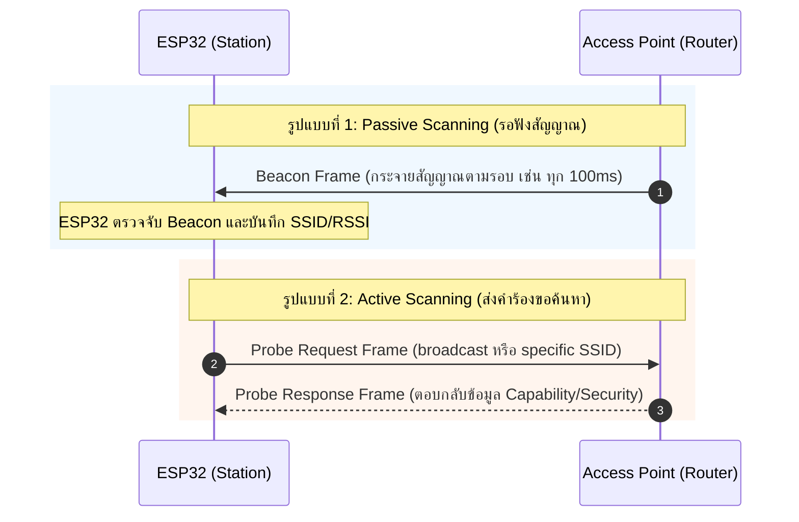

# เฟสย่อยที่ 1: Scan Phase (การสแกนหาเครือข่าย Wi-Fi)

ในการเชื่อมต่อ Wi-Fi ของ ESP32 ขั้นตอนแรกสุดหลังจากเริ่มต้น Wi-Fi Driver คือ **Scan Phase** ซึ่งเป็นกระบวนการค้นหา Access Point (AP) ในบริเวณใกล้เคียงเพื่อตรวจสอบว่า AP ที่ระบุไว้ใน Configuration (SSID และ BSSID) มีอยู่จริง ทำงานอยู่ใน Channel ใด และมีระดับความแรงสัญญาณ (RSSI) เท่าใด

---

## 1. กลไกการสแกนสัญญาณ (Scanning Mechanisms)

กระบวนการสแกนสัญญาณตามมาตรฐาน IEEE 802.11 แบ่งออกเป็น 2 รูปแบบหลักดังรูป



1. **Passive Scanning (การสแกนแบบตั้งรับ)**: ESP32 จะคอยรับฟังแพ็กเกจ **Beacon Frame** ที่ AP ส่งกระจายออกมาตามรอบเวลา (ปกติประมาณ 100ms) ในแต่ละ Channel การสแกนแบบนี้ช่วยประหยัดพลังงานแต่ใช้เวลานานกว่า
2. **Active Scanning (การสแกนแบบรุก - เป็น Default ของ ESP32)**: ESP32 จะส่ง **Probe Request Frame** ออกไปในทุกช่องสัญญาณ (Channel 1-13) แล้วรอรับ **Probe Response Frame** จาก AP เพื่อให้ทราบข้อมูลของเครือข่ายอย่างรวดเร็ว

---

## 2. ลำดับขั้นตอนและ Event ภายใน ESP32 Driver

* **s1.1**: เมื่อแอปพลิเคชันเรียกใช้คำสั่ง `esp_wifi_connect()` หรือ `WiFi.begin(ssid, password)` Wi-Fi Driver จะเริ่มเข้าสู่ State สแกนหา Access Point ตาม SSID ที่กำหนดไว้ใน Configuration
* **s1.2**: หากทำการสแกนครบทุก Channel แล้ว **สแกนไม่พบ Access Point** (เช่น AP ปิดอยู่, อยู่ไกลเกินไป, หรือพิมพ์ SSID ผิด)
  * ไดรเวอร์จะปล่อย Event ชื่อ `WIFI_EVENT_STA_DISCONNECTED`
  * Wi-Fi driver จะส่ง result code / Disconnect Reason ออกมาเป็น:
    - **`WIFI_REASON_NO_AP_FOUND`** (0x201 / Value 201)

---

## 3. ตัวอย่างการใช้คำสั่งสแกนในทางปฏิบัติ (Code Examples)

### ตัวอย่าง: ESP-IDF Scan API (C Language)
```c
wifi_scan_config_t scan_config = {
    .ssid = (uint8_t *)"MyHomeWiFi", // สแกนหา SSID ที่ระบุ
    .bssid = NULL,
    .channel = 0,                    // 0 = สแกนทุก Channel (1-13)
    .show_hidden = true              // รวม Hidden SSID ด้วย
};
// สั่งสแกนหา AP
ESP_ERROR_CHECK(esp_wifi_scan_start(&scan_config, true));
```

### ตัวอย่าง: Arduino ESP32 Scan API (C++)
```cpp
#include <WiFi.h>

void setup() {
  Serial.begin(115200);
  WiFi.mode(WIFI_STA);
  WiFi.disconnect();
  
  int n = WiFi.scanNetworks(); // ทำการ Active Scan
  Serial.printf("พบเครือข่ายทั้งหมด %d เครือข่าย\n", n);
  for (int i = 0; i < n; ++i) {
    Serial.printf("%d: %s (%d dBm)\n", i + 1, WiFi.SSID(i).c_str(), WiFi.RSSI(i));
  }
}
```

---

## 4. สาเหตุปัญหาในเฟส Scan และแนวทางแก้ไข (Troubleshooting)

| ปัญหาที่พบ | สาเหตุที่เป็นไปได้ | แนวทางแก้ไข |
| :--- | :--- | :--- |
| `WIFI_REASON_NO_AP_FOUND` | สะกด SSID ไม่ถูกต้อง (ตัวพิมพ์เล็ก/ใหญ่มีผล) | ตรวจสอบตัวอักษรและช่องว่างใน SSID ให้ตรงเป๊ะ |
| สแกนไม่เจอสัญญาณ | AP ตั้งค่าความถี่เป็น 5GHz | ESP32 (ส่วนใหญ่เช่น WROOM-32) รองรับเฉพาะ **2.4GHz** เท่านั้น |
| สแกนไม่เจอ AP ซ่อนอยู่ | AP เป็นแบบ Hidden SSID | ตั้งค่า `scan_method = WIFI_ALL_CHANNEL_SCAN` และเปิด flag `show_hidden` |
| สัญญาณขาดหายเป็นระยะ | AP อยู่ใน Channel ที่มีสัญญาณรบกวนสูง | เปลี่ยน Channel ของ AP หรือเพิ่มสายอากาศภายนอก |

---

## 5. คำถามทบทวนความเข้าใจ (Checkpoints)

1. **การสแกนแบบ Active Scanning กับ Passive Scanning ต่างกันอย่างไรในแง่ของปริมาณ Traffic บนอากาศและเวลาที่ใช้?**
   - **Active Scanning:** มีการส่งแพ็กเกจ (Probe Request) ออกไป ทำให้ **สร้าง Traffic บนอากาศมากกว่า** แต่ใช้ **เวลาน้อยกว่า** ในการค้นหาเครือข่าย เนื่องจากสามารถเร่งกระบวนการขอข้อมูลจาก AP ได้ทันทีโดยไม่ต้องรอรอบเวลา
   - **Passive Scanning:** เป็นการรับฟังสัญญาณเพียงอย่างเดียว ทำให้ **ไม่มี Traffic ขาออกจากตัวอุปกรณ์ (ประหยัดพลังงาน)** แต่ใช้ **เวลานานกว่า** เพราะต้องรอให้ Access Point ส่ง Beacon Frame ออกมาตามรอบเวลาปกติ (เช่น ทุก ๆ 100ms) ในแต่ละ Channel

2. **หาก ESP32 รองรับเฉพาะความถี่ 2.4GHz แต่เราพยายามเชื่อมต่อกับ Router 5GHz จะเกิด Event ใด และได้ Reason Code อะไร?**
   - **ตอบ:** ESP32 จะไม่สามารถตรวจจับสัญญาณคลื่น 5GHz ได้ ทำให้การสแกนหาเครือข่ายไม่พบ (No AP Found) และจะกระตุ้น Event `WIFI_EVENT_STA_DISCONNECTED` พร้อมด้วย Disconnect Reason Code คือ **`WIFI_REASON_NO_AP_FOUND`** (Value: 201 / 0x201)
