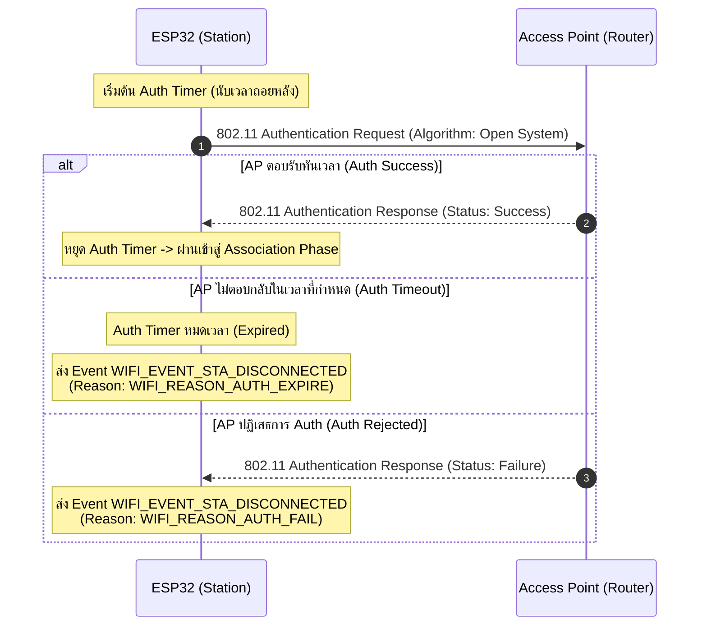

# เฟสย่อยที่ 2: Auth Phase (Authentication Phase)

หลังจากที่ ESP32 สแกนพบ Access Point (AP) เป้าหมายเรียบร้อยแล้ว ESP32 จะเข้าสู่ **Auth Phase** ซึ่งเป็นกระบวนการยืนยันตัวตนระดับ Link Layer (802.11 Authentication) ก่อนที่จะเริ่มขอสิทธิ์การผูกสัมพันธ์ในระดับเครือข่าย

> [!NOTE]
> ในเครือข่าย Wi-Fi ที่ใช้ความปลอดภัยแบบ WPA2/WPA3 ขั้นตอนนี้จะเป็นแบบ **Open System Authentication** (ยินยอมให้ยืนยันตัวตนผ่านในระดับ 802.11 Link Layer ไปก่อน) แล้วค่อยไปตรวจสอบรหัสผ่านจริงใน **Four-way Handshake Phase (เฟส 4)**

---

## 1. ลำดับการแลกเปลี่ยนแพ็กเกจ Authentication (Sequence Diagram)

---

## 2. รายละเอียดขั้นตอนทางเทคนิค (Step Breakdown)

* **s2.1**: ESP32 เริ่มต้นขั้นตอนการร้องขอการยืนยันตัวตน (Authentication Request) ไปยัง AP พร้อมกันนั้น **Auth Timer** ของระบบปฏิบัติการจะเริ่มนับเวลา เพื่อควบคุมเวลาที่ใช้ในการรอคอยแพ็กเกจตอบรับ
* **s2.2 (กรณีหมดเวลา)**: หากเวลาผ่านไปจนเกินค่า Timeout ที่กำหนดไว้แล้ว แต่ยังไม่ได้รับการตอบรับจาก AP:
  * ไดรเวอร์จะปล่อย Event ชื่อ **`WIFI_EVENT_STA_DISCONNECTED`**
  * ไดรเวอร์จะแจ้ง Result Code / Disconnect Reason ออกมาเป็น: **`WIFI_REASON_AUTH_EXPIRE`** (Value 2)
* **s2.3 (กรณีสำเร็จ)**: หากได้รับแพ็กเกจตอบรับจาก AP เป็นสถานะ Success ภายในเวลาที่กำหนด **Auth Timer จะหยุดลงทันที** และสิ้นสุดกระบวนการ Authentication ในระดับ Link Layer เพื่อเข้าสู่เฟสถัดไป
* **s2.4 (กรณีถูกปฏิเสธ)**: หาก AP ส่งแพ็กเกจ Authentication Response ตอบกลับมา แต่ระบุสถานะ**ปฏิเสธการเข้าถึง (Rejection)**:
  * ไดรเวอร์จะปล่อย Event ชื่อ **`WIFI_EVENT_STA_DISCONNECTED`**
  * ไดรเวอร์จะแจ้ง Result Code / Disconnect Reason ออกมาเป็น: **`WIFI_REASON_AUTH_FAIL`** (Value 1)

---

## 3. ตารางสรุป Result Code และสาเหตุใน Auth Phase

| Reason Code Constant | รหัสตัวเลข | สื่อความหมายถึง | สาเหตุที่อาจเกิดขึ้นในทางปฏิบัติ |
| :--- | :--- | :--- | :--- |
| `WIFI_REASON_AUTH_FAIL` | 1 | AP ปฏิเสธคำขอ Authentication | MAC Address Filtering บน AP บล็อก ESP32 ไว้ หรือ AP อยู่ในสถานะ Overload |
| `WIFI_REASON_AUTH_EXPIRE` | 2 | หมดเวลาการรอตอบรับ Auth | สัญญาณ Wi-Fi อ่อนมาก แพ็กเกจหล่นหายในอากาศ (Packet Loss) |

---

## 4. คำถามทบทวนความเข้าใจ (Checkpoints)

1. **ทำไมในเครือข่าย WPA2-PSK ขั้นตอน Auth Phase นี้ถึงผ่านได้แม้เราจะพิมพ์รหัสผ่านผิด?**
   - **ตอบ:** เพราะในมาตรฐาน WPA2-PSK ขั้นตอน Auth Phase เป็นแบบ **Open System Authentication** ในระดับ Link Layer (Layer 2) ซึ่งจะยังไม่นำรหัสผ่าน (PSK) มาตรวจสอบในขั้นตอนนี้ โดยระบบจะอนุญาตให้ผ่านไปก่อนเพื่อให้ไปจับมือแลกเปลี่ยนคีย์ความปลอดภัยกันใน **Four-way Handshake Phase (เฟสที่ 4)** แทน ดังนั้น หากพิมพ์รหัสผ่านผิด จะยังไม่แสดง Error ในเฟส Auth นี้ แต่จะไปล้มเหลวในเฟสที่ 4 แทน

2. **หาก Router มีการเปิดใช้งาน MAC Address Filtering (อนุญาตเฉพาะอุปกรณ์ที่ลงทะเบียน MAC ไว้) ESP32 จะล้มเหลวที่ขั้นตอนใด และได้ Reason Code อะไร?**
   - **ตอบ:** จะล้มเหลวใน **เฟสที่ 2: Auth Phase** และจะได้รับ Event `WIFI_EVENT_STA_DISCONNECTED` พร้อมกับ Result Code คือ **`WIFI_REASON_AUTH_FAIL`** (รหัสตัวเลข 1) เนื่องจาก AP ตรวจสอบ MAC Address แล้วไม่พบในรายชื่อที่อนุญาต จึงปฏิเสธคำขอ Authentication ทันที
