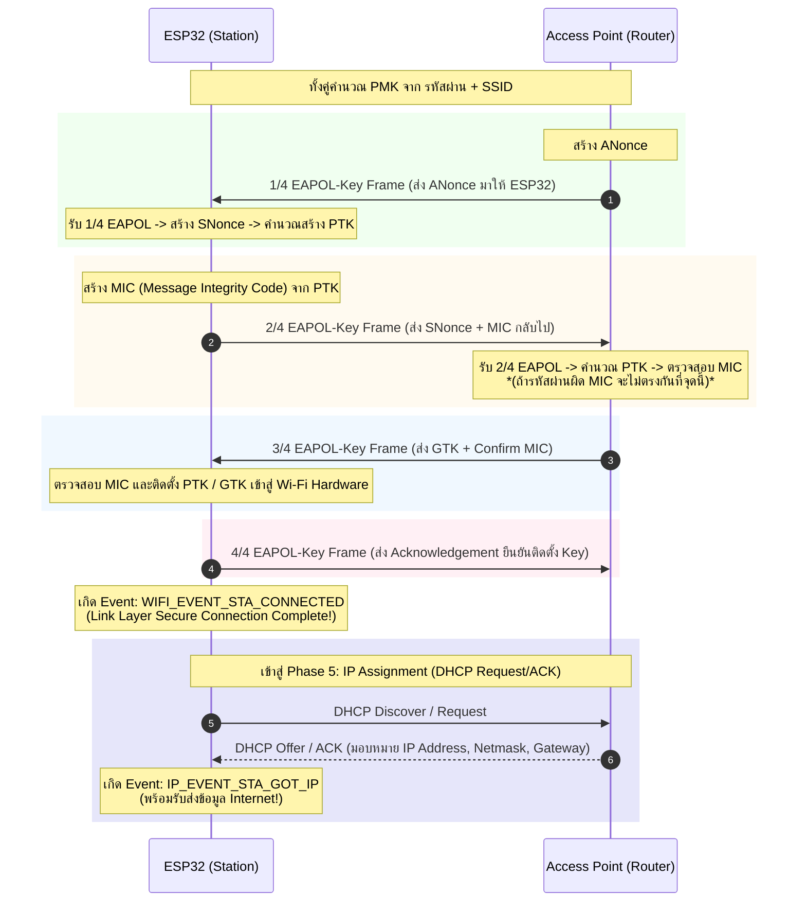

# เฟสย่อยที่ 4: Four-way Handshake Phase (การตกลงคีย์ความปลอดภัยและรับ IP Address)

หลังจากผ่านขั้นตอนการผูกสัมพันธ์ (Association) แล้ว ESP32 จะเข้าสู่เฟสที่สำคัญที่สุดในด้านความปลอดภัย คือ **Four-way Handshake Phase** ซึ่งใช้โปรโตคอล **EAPOL (Extensible Authentication Protocol over LAN)** ตามมาตรฐาน WPA2/WPA3 Personal (PSK) เพื่อพิสูจน์ทราบว่าทั้ง ESP32 และ AP รู้รหัสผ่าน (Pre-Shared Key - PSK) เดียวกัน และทำการสร้างคีย์สำหรับเข้ารหัสข้อมูลในอากาศโดยที่**ไม่มีการส่งรหัสผ่านจริงผ่านคลื่นวิทยุ**

---

## 1. แนวคิดเรื่อง Encryption Keys ใน 4-Way Handshake

* **PMK (Pairwise Master Key)**: คีย์หลักที่คำนวณจาก `Passphrase` (รหัสผ่าน Wi-Fi) และ `SSID` ผ่านอัลกอริทึม PBKDF2
* **ANonce & SNonce**: ค่าสุ่มตัวเลขโดด (Random Number) ที่สร้างโดย AP (ANonce) และ Station ESP32 (SNonce)
* **PTK (Pairwise Transient Key)**: คีย์เข้ารหัสแบบ unicast ที่ใช้จริงในการเข้ารหัสข้อมูลระหว่าง ESP32 กับ AP (สร้างจากการผสม PMK + ANonce + SNonce + MAC Addresses)
* **GTK (Group Temporal Key)**: คีย์เข้ารหัสแบบ broadcast/multicast สำหรับรับข้อมูลที่ AP กระจายหาทุก Client

---

## 2. ลำดับการแลกเปลี่ยนแพ็กเกจ 4-Way Handshake (Sequence Diagram)

---

## 3. รายละเอียดขั้นตอนทางเทคนิค (Step Breakdown)

* **s4.1 (1/4 EAPOL)**: เริ่มกระบวนการ Handshake AP จะส่งแพ็กเกจ **1/4 EAPOL** ซึ่งบรรจุค่า `ANonce` มายัง ESP32 หาก Handshake Timer เกิด Timeout และไม่ได้รับแพ็กเกจ 1/4 EAPOL:
  * เกิด Event: `WIFI_EVENT_STA_DISCONNECTED`
  * Result Code: **`WIFI_REASON_HANDSHAKE_TIMEOUT`** (15)
* **s4.2**: ESP32 ได้รับแพ็กเกจ **1/4 EAPOL** สำเร็จ นำ ANonce มาคำนวณสร้าง PTK ร่วมกับ SNonce ของตนเอง
* **s4.3 (2/4 EAPOL)**: ESP32 ตอบกลับแพ็กเกจ **2/4 EAPOL** โดยแนบค่า `SNonce` และ `MIC` (รหัสยืนยันความถูกต้อง) กลับไปให้ AP
  * **จุดสังเกต**: หากป้อนรหัสผ่าน Wi-Fi ผิด ค่า PMK ของ ESP32 จะไม่ตรงกับ AP ทำให้ MIC ที่สร้างในขั้นตอนนี้ผิดพลาด AP จะปฏิเสธ และเกิด Disconnect
* **s4.4 (3/4 EAPOL)**: ESP32 รอรับแพ็กเกจ **3/4 EAPOL** จาก AP หากไม่ได้รับตามเวลาที่กำหนด:
  * เกิด Event: `WIFI_EVENT_STA_DISCONNECTED`
  * Result Code: **`WIFI_REASON_HANDSHAKE_TIMEOUT`** (15) หรือ **`WIFI_REASON_4WAY_HANDSHAKE_TIMEOUT`** (204)
* **s4.5**: ESP32 ได้รับแพ็กเกจ **3/4 EAPOL** ซึ่งบรรจุคีย์ `GTK` และคำยืนยันจาก AP
* **s4.6 (4/4 EAPOL)**: ESP32 ส่งแพ็กเกจ **4/4 EAPOL** เพื่อยืนยันว่าได้ติดตั้งคีย์เข้ารหัสในระดับฮาร์ดแวร์เรียบร้อยแล้ว
* **s4.7 (Link Connected)**: เกิด Wi-Fi Event **`WIFI_EVENT_STA_CONNECTED`** แสดงว่าระดับ Link Layer ปลอดภัยและเชื่อมต่อสำเร็จ

> **หลังจากสเต็ป s4.7**: ESP32 จะเริ่มขอหมายเลข IP Address จาก DHCP Server บน Router เมื่อได้รับ IP แล้ว จะเกิด Event **`IP_EVENT_STA_GOT_IP`** ซึ่งเป็นจุดสิ้นสุดอย่างสมบูรณ์ และทำให้ ESP32 สามารถใช้งาน Wi-Fi Station รับส่งข้อมูลเครือข่ายได้!

---

## 4. ตารางรวมสรุป Disconnect Reason Codes ทั้งหมด (Wi-Fi Diagnostic Table)

ตารางนี้เป็นคู่มืออ้างอิงสำคัญสำหรับนักศึกษาในการ Debug เมื่อ Wi-Fi เกิดปัญหากลางทาง:

| Reason Constant | รหัส | เฟสที่เกิด | สาเหตุหลักและการวิเคราะห์ปัญหา |
| :--- | :--- | :--- | :--- |
| `WIFI_REASON_UNSPECIFIED` | 1 | ทุกเฟส | ข้อผิดพลาดที่ไม่ระบุสาเหตุชัดเจน |
| `WIFI_REASON_AUTH_EXPIRE` | 2 | Phase 2 (Auth) | สัญญาณอ่อนมาก ร้องขอ Auth แล้วไม่มีการตอบรับ |
| `WIFI_REASON_AUTH_FAIL` | 1 / 202 | Phase 2 / Phase 4 | AP ปฏิเสธการ Auth หรือใส่รหัสผ่านผิดอย่างรุนแรง |
| `WIFI_REASON_ASSOC_EXPIRE` | 4 | Phase 3 (Assoc) | หมดเวลาการร้องขอ Association |
| `WIFI_REASON_ASSOC_FAIL` | 3 | Phase 3 (Assoc) | AP ปฏิเสธ Association |
| `WIFI_REASON_NOT_AUTHED` | 6 | Phase 3 | พยายามส่ง Assoc ทั้งที่ยัง Auth ไม่ผ่าน |
| `WIFI_REASON_HANDSHAKE_TIMEOUT` | 15 / 204 | Phase 4 (Handshake) | **พิมพ์รหัสผ่าน Wi-Fi (Password) ผิด** หรือสัญญาณขาดหายขณะแลกเปลี่ยน EAPOL |
| `WIFI_REASON_NO_AP_FOUND` | 201 | Phase 1 (Scan) | **พิมพ์ชื่อ Wi-Fi (SSID) ผิด** หรือ AP ปิดอยู่ / เป็น 5GHz |
| `WIFI_REASON_CONNECTION_FAIL` | 208 | Phase 4/DHCP | การสถาปนาการเชื่อมต่อในระดับ Driver ล้มเหลว |

---

## 5. คำถามทบทวนความเข้าใจ (Checkpoints)

1. **ในกระบวนการ 4-Way Handshake เหตุใดจึงไม่มีการส่งรหัสผ่าน (Password) ลอยไปในอากาศเลยแม้แต่แพ็กเกจเดียว?**
   - **ตอบ:** เพราะรหัสผ่าน (Passphrase) ถูกนำไปใช้ในฝั่งของ ESP32 และ AP แบบ Local เพื่อคำนวณสร้างค่า **PMK (Pairwise Master Key)** ล่วงหน้า จากนั้นในขั้นตอน 4-way Handshake จะเป็นการแลกเปลี่ยนเฉพาะค่าตัวเลขสุ่ม (ANonce, SNonce) และใช้คีย์ร่วมกันในการสร้าง **PTK (Pairwise Transient Key)** พร้อมแนบรหัสยืนยันความถูกต้อง (MIC) แทนการส่งรหัสผ่านจริงข้ามคลื่นวิทยุ เพื่อป้องกันการถูกดักจับข้อมูล (Sniffing Attack)

2. **เหตุใดการพิมพ์รหัสผ่าน Wi-Fi ผิดใน ESP32 จึงมักหลุดที่ขั้นตอน 2/4 EAPOL หรือ 3/4 EAPOL ไม่ใช่ตั้งแต่เฟส 1 หรือ 2?**
   - **ตอบ:** เพราะเฟสที่ 1 (Scan) และเฟสที่ 2 (Auth) เป็นการตรวจสอบเฉพาะชื่อเครือข่าย (SSID) และการยืนยันตัวตนแบบเปิด (Open System Authentication) ในระดับ Link Layer โดยยังไม่มีการนำรหัสผ่านมาตรวจสอบ จนกระทั่งเข้าสู่ **เฟสที่ 4 (Four-way Handshake)** ที่ ESP32 ต้องใช้รหัสผ่านแปลงเป็น PMK เพื่อสร้าง MIC ส่งไปในแพ็กเกจ 2/4 EAPOL หากรหัสผ่านผิด ค่า PMK จะไม่ตรงกับ AP ทำให้ MIC ผิดพลาดและ AP ปฏิเสธการเชื่อมต่อในที่สุด

3. **ความแตกต่างสำคัญระหว่าง Event `WIFI_EVENT_STA_CONNECTED` กับ `IP_EVENT_STA_GOT_IP` คืออะไร?**
   - **ตอบ:** 
     - **`WIFI_EVENT_STA_CONNECTED`**: เป็นการแจ้งเตือนความสำเร็จในระดับ **Link Layer (Layer 2)** เมื่อผ่าน 4-way Handshake และตั้งค่าคีย์ความปลอดภัยเรียบร้อยแล้ว แต่อุปกรณ์ยังไม่มีหมายเลขไอพี
     - **`IP_EVENT_STA_GOT_IP`**: เป็นการแจ้งเตือนความสำเร็จในระดับ **Network Layer (Layer 3)** หลังจากที่ TCP/IP Stack (lwIP) ทำกระบวนการขอ IP จาก DHCP Server สำเร็จและได้รับหมายเลข IP Address, Subnet Mask รวมถึง Gateway เรียบร้อย พร้อมเชื่อมต่ออินเทอร์เน็ตจริง
