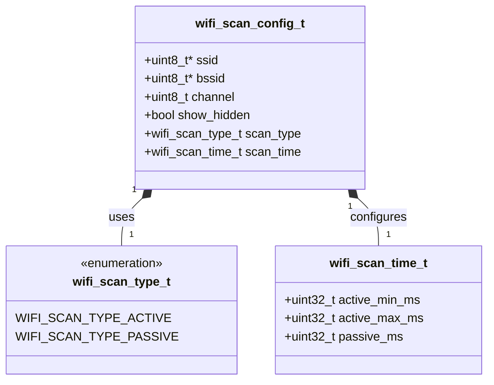
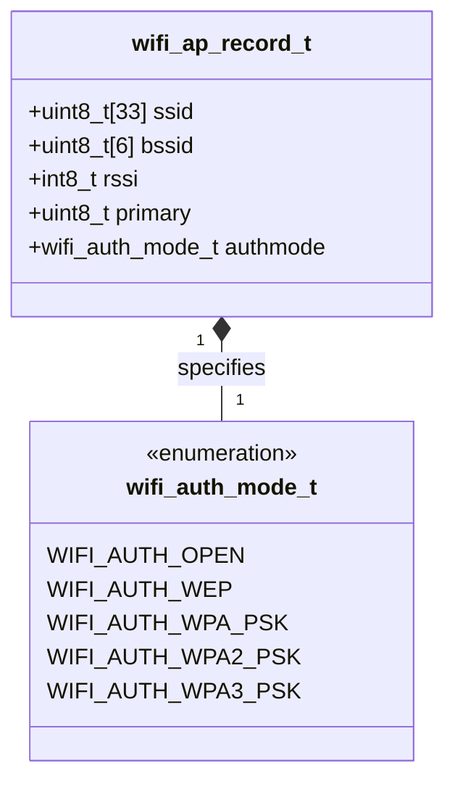

# ใบงานที่ 5.1: การเชื่อมต่อ Wi-Fi และการค้นหาสัญญาณรอบข้าง (Wi-Fi Connection and Scanning)

## 0. กล่าวนำ (Introduction)
ใบงานในสัปดาห์นี้ จะแสดง console log แบบ forensic  โดยละเอียด จะทำให้นักศึกษาเห็นทั้งฟังก์ชันที่เรียกใช้งานและค่าที่ return กลับมา
เพื่อให้เกิดประสบการณ์ในการวิเคราะห์ปัญหาหน้างานจริงในการใช้ Wi-Fi บน ESP32 ที่รันบน framework ESP-IDF ได้

## 1. วัตถุประสงค์ (Objectives)
1. เรียนรู้และเข้าใจกระบวนการทำงานเบื้องต้นของการใช้งาน ESP32 ในโหมด Station (STA Mode) ผ่านเฟรมเวิร์ก ESP-IDF
2. เรียนรู้การตั้งค่าและใช้งาน API สำหรับสแกนสัญญาณ Wi-Fi (Scan Phase) ในรูปแบบต่าง ๆ ผ่าน `esp_wifi.h`
3. สามารถเขียนโปรแกรมค้นหา Access Point (AP) แบบทั่วไป (General Scan), แบบระบุช่องความถี่ (Channel-Specific Scan) และแบบระบุชื่อเครือข่ายเจาะจง (Targeted SSID Scan)
4. อ่านค่าและแสดงผลรายละเอียดของ AP เช่น SSID, MAC Address (BSSID), RSSI, Channel และ Encryption Type ผ่าน Serial Monitor (ESP-IDF Console) ได้อย่างถูกต้อง

---

## 2. อุปกรณ์และซอฟต์แวร์ที่ใช้ในการทดลอง (Equipment & Tools)
1. บอร์ดไมโครคอนโทรลเลอร์ ESP32 (เช่น ESP32 DevKit V1) จำนวน 1 บอร์ด
2. สายเชื่อมต่อ Micro-USB หรือ USB-C (ตามรุ่นของบอร์ด) จำนวน 1 เส้น
3. คอมพิวเตอร์ที่ติดตั้งโปรแกรม IDE เช่น VS Code พร้อมทั้ง ESP-IDF (อาจจะติดตั้งบนเครื่องหรือบน Docker ก็ได้)

---

## 3. ความรู้พื้นฐานที่เกี่ยวข้อง (Theoretical Background - ESP-IDF Framework)

### 3.1 การเริ่มต้น Wi-Fi Stack บน ESP-IDF
ในเฟรมเวิร์ก ESP-IDF การทำงานของ Wi-Fi จำเป็นต้องเริ่มต้นโมดูลพื้นฐานของระบบก่อนตามลำดับ ได้แก่ NVS Flash (สำหรับจัดเก็บ Configuration), Network Interface (esp_netif) และ Event Loop ดังตัวอย่างต่อไปนี้

```c
#include "nvs_flash.h"
#include "esp_netif.h"
#include "esp_event.h"
#include "esp_wifi.h"

void init_wifi_sta(void) {
    // 1. Initialize NVS Flash
    esp_err_t ret = nvs_flash_init();
    if (ret == ESP_ERR_NVS_NO_FREE_PAGES || ret == ESP_ERR_NVS_NEW_VERSION_FOUND) {
        ESP_ERROR_CHECK(nvs_flash_erase());
        ret = nvs_flash_init();
    }
    ESP_ERROR_CHECK(ret);

    // 2. Initialize Network Interface & Event Loop
    ESP_ERROR_CHECK(esp_netif_init());
    ESP_ERROR_CHECK(esp_event_loop_create_default());
    esp_netif_create_default_wifi_sta();

    // 3. Initialize Wi-Fi Driver in Station Mode
    wifi_init_config_t cfg = WIFI_INIT_CONFIG_DEFAULT();
    ESP_ERROR_CHECK(esp_wifi_init(&cfg));
    ESP_ERROR_CHECK(esp_wifi_set_mode(WIFI_MODE_STA));
    ESP_ERROR_CHECK(esp_wifi_start());
}
```

### 3.2 กระบวนการสแกนสัญญาณด้วย `wifi_scan_config_t`
ในมาตรฐาน IEEE 802.11 กระบวนการ **Scan Phase** เป็นขั้นตอนแรกที่ ESP32 จะสำรวจสภาพแวดล้อมทางคลื่นวิทยุ 2.4GHz โดย ESP-IDF มีโครงสร้างข้อมูล `wifi_scan_config_t` สำหรับกำหนดเงื่อนไขในการสแกน

```c
typedef struct {
    uint8_t *ssid;               // Target SSID (NULL = scan all SSIDs)
    uint8_t *bssid;              // Target MAC address (NULL = scan all BSSIDs)
    uint8_t channel;             // Target channel (0 = scan all channels 1-13)
    bool show_hidden;            // true = include hidden SSIDs in scan result
    wifi_scan_type_t scan_type;  // WIFI_SCAN_TYPE_ACTIVE or WIFI_SCAN_TYPE_PASSIVE
    wifi_scan_time_t scan_time;  // Scan duration per channel
} wifi_scan_config_t;
```

#### แผนผังโครงสร้างข้อมูล (Class Diagram of `wifi_scan_config_t`)



**คำสั่งสั่งสแกน**  `esp_wifi_scan_start(&scan_config, true)` โดยหากใส่พารามิเตอร์ตัวหลังเป็น `true` จะเป็นการสแกนแบบ Synchronous (รอจนกว่าการสแกนจะเสร็จสมบูรณ์)

### 3.3 การดึงรายละเอียดของ Access Point (`wifi_ap_record_t`)
เมื่อสแกนเสร็จสิ้น สามารถอ่านจำนวน AP ที่พบด้วย `esp_wifi_scan_get_ap_num()` และอ่านรายละเอียดโครงสร้าง `wifi_ap_record_t` ด้วย `esp_wifi_scan_get_ap_records()` ซึ่งประกอบด้วยสมาชิกสำคัญ ดังต่อไปนี้

#### แผนผังโครงสร้างข้อมูล (Class Diagram of `wifi_ap_record_t`)



| ตัวแปรสมาชิก | รายละเอียด                 | ข้อมูล                          |
| ------------ | -------------------------- | ------------------------------- |
| `ssid`       | ชื่อเครือข่าย Wi-Fi        | (อาร์เรย์ uint8_t ขนาด 33 ไบต์) |
| `bssid`      | หมายเลข MAC Address ของ AP | (อาร์เรย์ uint8_t ขนาด 6 ไบต์)  |
| `rssi`       | ความแรงของสัญญาณวิทยุ      | (หน่วย dBm)                     |
| `primary`    | ช่องความถี่วิทยุหลัก       | (Channel 1-13)                  |
| `authmode`   | ประเภทการเข้ารหัสความปลอดภัย | (`wifi_auth_mode_t` เช่น `WIFI_AUTH_OPEN`, `WIFI_AUTH_WPA2_PSK`, `WIFI_AUTH_WPA3_PSK`)|

---

## 4. ขั้นตอนและโปรแกรมทดสอบการทดลอง (Experimental Procedures)

ในใบงานนี้ โปรแกรมจะทำการสแกนค้นหาสัญญาณ Wi-Fi ใน 4 กรณีหลักแบบ Forensic Logging และจะ**หยุดการทำงานในเฟสที่ 1 (Scan Phase)** เท่านั้น โดยแสดงผลสรุปผ่าน ESP-IDF Serial Console

### 5.1.1 การสแกนหา AP ทั่วไป (General AP Scan)
เป็นการสแกนครอบคลุมทุกช่องความถี่ (Channel 1-13) และทุก SSID (`.ssid = NULL`, `.channel = 0`) เพื่อสำรวจเครือข่าย Wi-Fi ทั้งหมดที่อยู่บริเวณรอบข้าง

### 5.1.2 การสแกนหา AP โดยกำหนดช่วงความถี่ (Channel-Specific Scan)
เป็นการระบุช่องความถี่เจาะจง (เช่น `.channel = 1`) เพื่อลดเวลาที่ใช้ในการสแกน เหมาะสำหรับกรณีที่ทราบล่วงหน้าว่า AP เป้าหมายทำงานอยู่ใน Channel ใด

### 5.1.3 การสแกนหา AP โดยกำหนดชื่อที่เจาะจงกรณีมีอยู่จริง (Targeted SSID Scan - Existing)
เป็นการระบุชื่อ SSID ที่ต้องการสแกนโดยเฉพาะ (`.ssid = (uint8_t *)"Target_SSID"`) นำชื่อ SSID ที่พบจากการสแกนทั่วไปในข้อ 5.1.1 มาทดสอบสแกนแบบเจาะจง

### 5.1.4 การสแกนหา AP โดยกำหนดชื่อที่เจาะจงกรณีไม่มีอยู่จริง (Targeted SSID Scan - Non-Existent)
เป็นการระบุชื่อ SSID สมมุติที่ไม่มีอยู่จริง (ในใบงานนี้คือ `"NON_EXISTENT_AP_9999"`) เพื่อสังเกตการตอบสนองและ Error Handling ของระบบ (พบ 0 AP)

---

## 5. ซอร์สโค้ดการทดลอง (Complete ESP-IDF Source Code - `main.c`)

ให้นักศึกษานำซอร์สโค้ด C ต่อไปนี้ไปวางในไฟล์ `main/main.c` ของโปรเจกต์ ESP-IDF ทำการ Build และ Flash ลงบอร์ด ESP32 จากนั้นเปิด ESP-IDF Monitor (Baud Rate `115200`) เพื่อสังเกตผลการทำงาน

```c
#include "esp_event.h"
#include "esp_log.h"
#include "esp_netif.h"
#include "esp_system.h"
#include "esp_timer.h"
#include "esp_wifi.h"
#include "freertos/FreeRTOS.h"
#include "freertos/task.h"
#include "nvs_flash.h"
#include <stdio.h>
#include <string.h>

static const char *TAG = "LAB_WIFI_SCAN";

// Convert wifi_auth_mode_t enum to readable string
static const char *get_auth_mode_name(wifi_auth_mode_t authmode) {
  switch (authmode) {
  case WIFI_AUTH_OPEN:
    return "OPEN (No Password)";
  case WIFI_AUTH_WEP:
    return "WEP";
  case WIFI_AUTH_WPA_PSK:
    return "WPA_PSK";
  case WIFI_AUTH_WPA2_PSK:
    return "WPA2_PSK";
  case WIFI_AUTH_WPA_WPA2_PSK:
    return "WPA_WPA2_PSK";
  case WIFI_AUTH_WPA2_ENTERPRISE:
    return "WPA2_ENTERPRISE";
  case WIFI_AUTH_WPA3_PSK:
    return "WPA3_PSK";
  case WIFI_AUTH_WPA2_WPA3_PSK:
    return "WPA2_WPA3_PSK";
  case WIFI_AUTH_WAPI_PSK:
    return "WAPI_PSK";
  default:
    return "UNKNOWN";
  }
}

// Perform Wi-Fi scan and display detailed AP records
static void perform_wifi_scan(wifi_scan_config_t *scan_config,
                              const char *test_title, char *found_first_ssid,
                              size_t max_ssid_len) {
  ESP_LOGI(
      TAG,
      "------------------------------------------------------------------");
  ESP_LOGI(TAG, ">>> %s", test_title);
  ESP_LOGI(
      TAG,
      "------------------------------------------------------------------");

  ESP_LOGI(TAG,
           "[FORENSIC]: Call esp_wifi_scan_start(scan_config, block=true)");
  int64_t start_time = esp_timer_get_time();
  esp_err_t err = esp_wifi_scan_start(scan_config, true);
  int64_t duration_ms = (esp_timer_get_time() - start_time) / 1000;
  ESP_LOGI(TAG,
           "[FORENSIC]: esp_wifi_scan_start() returned %s (0x%x) [Duration: "
           "%lld ms]",
           esp_err_to_name(err), err, duration_ms);

  if (err != ESP_OK) {
    ESP_LOGE(TAG, "[STATUS]: Scan failed (Error: %s / Code: 0x%x)",
             esp_err_to_name(err), err);
    return;
  }

  uint16_t ap_count = 0;
  ESP_LOGI(TAG, "[FORENSIC]: Call esp_wifi_scan_get_ap_num(&ap_count)");
  esp_err_t err_ap_num = esp_wifi_scan_get_ap_num(&ap_count);
  ESP_LOGI(
      TAG,
      "[FORENSIC]: esp_wifi_scan_get_ap_num() returned %s (0x%x), ap_count=%u",
      esp_err_to_name(err_ap_num), err_ap_num, ap_count);

  ESP_LOGI(TAG, "[STATUS]: Scan SUCCESS");
  ESP_LOGI(TAG, "[AP COUNT]: %u network(s) found", ap_count);

  if (ap_count == 0) {
    ESP_LOGW(TAG, "[NOTE]: No Access Point found matching the criteria.");
  } else {
    wifi_ap_record_t *ap_info =
        (wifi_ap_record_t *)malloc(sizeof(wifi_ap_record_t) * ap_count);
    if (ap_info == NULL) {
      ESP_LOGE(TAG, "Failed to allocate memory for AP scan records");
      return;
    }

    uint16_t number = ap_count;
    ESP_LOGI(TAG,
             "[FORENSIC]: Call esp_wifi_scan_get_ap_records(&number, ap_info)");
    esp_err_t err_ap_rec = esp_wifi_scan_get_ap_records(&number, ap_info);
    ESP_LOGI(TAG,
             "[FORENSIC]: esp_wifi_scan_get_ap_records() returned %s (0x%x), "
             "records=%u",
             esp_err_to_name(err_ap_rec), err_ap_rec, number);
    ESP_ERROR_CHECK(err_ap_rec);

    // Save first found SSID for targeted scan test
    if (found_first_ssid != NULL && number > 0) {
      snprintf(found_first_ssid, max_ssid_len, "%s", (char *)ap_info[0].ssid);
    }

    printf("\n-----------------------------------------------------------------"
           "---------------------------------\n");
    printf("%-4s | %-24s | %-17s | %-6s | %-4s | %-20s\n", "No.", "SSID",
           "MAC Address (BSSID)", "RSSI", "Chan", "Encryption Type");
    printf("-------------------------------------------------------------------"
           "-------------------------------\n");

    for (int i = 0; i < number; i++) {
      char bssid_str[18];
      snprintf(bssid_str, sizeof(bssid_str), "%02X:%02X:%02X:%02X:%02X:%02X",
               ap_info[i].bssid[0], ap_info[i].bssid[1], ap_info[i].bssid[2],
               ap_info[i].bssid[3], ap_info[i].bssid[4], ap_info[i].bssid[5]);

      const char *ssid_display = (strlen((char *)ap_info[i].ssid) > 0)
                                     ? (char *)ap_info[i].ssid
                                     : "<Hidden SSID>";

      printf("%-4d | %-24s | %-17s | %-4d dBm | %-4d | %-20s\n", i + 1,
             ssid_display, bssid_str, ap_info[i].rssi, ap_info[i].primary,
             get_auth_mode_name(ap_info[i].authmode));
    }
    printf("-------------------------------------------------------------------"
           "-------------------------------\n\n");

    free(ap_info);
  }
}

void app_main(void) {
  // 1. Initialize NVS Flash (Required for Wi-Fi stack)
  ESP_LOGI(TAG, "[FORENSIC]: Call nvs_flash_init()");
  esp_err_t ret = nvs_flash_init();
  ESP_LOGI(TAG, "[FORENSIC]: nvs_flash_init() returned %s (0x%x)",
           esp_err_to_name(ret), ret);
  if (ret == ESP_ERR_NVS_NO_FREE_PAGES ||
      ret == ESP_ERR_NVS_NEW_VERSION_FOUND) {
    ESP_LOGI(TAG, "[FORENSIC]: Call nvs_flash_erase()");
    ESP_ERROR_CHECK(nvs_flash_erase());
    ret = nvs_flash_init();
    ESP_LOGI(TAG, "[FORENSIC]: nvs_flash_init() retry returned %s (0x%x)",
             esp_err_to_name(ret), ret);
  }
  ESP_ERROR_CHECK(ret);

  // 2. Initialize Network Interface and Default Event Loop
  ESP_LOGI(TAG, "[FORENSIC]: Call esp_netif_init()");
  esp_err_t err_netif = esp_netif_init();
  ESP_LOGI(TAG, "[FORENSIC]: esp_netif_init() returned %s (0x%x)",
           esp_err_to_name(err_netif), err_netif);
  ESP_ERROR_CHECK(err_netif);

  ESP_LOGI(TAG, "[FORENSIC]: Call esp_event_loop_create_default()");
  esp_err_t err_event = esp_event_loop_create_default();
  ESP_LOGI(TAG,
           "[FORENSIC]: esp_event_loop_create_default() returned %s (0x%x)",
           esp_err_to_name(err_event), err_event);
  ESP_ERROR_CHECK(err_event);

  ESP_LOGI(TAG, "[FORENSIC]: Call esp_netif_create_default_wifi_sta()");
  esp_netif_t *sta_netif = esp_netif_create_default_wifi_sta();
  ESP_LOGI(
      TAG,
      "[FORENSIC]: esp_netif_create_default_wifi_sta() returned pointer %p",
      sta_netif);

  // 3. Initialize Wi-Fi Driver in Station Mode
  wifi_init_config_t cfg = WIFI_INIT_CONFIG_DEFAULT();
  ESP_LOGI(TAG, "[FORENSIC]: Call esp_wifi_init(&cfg)");
  esp_err_t err_wifi_init = esp_wifi_init(&cfg);
  ESP_LOGI(TAG, "[FORENSIC]: esp_wifi_init() returned %s (0x%x)",
           esp_err_to_name(err_wifi_init), err_wifi_init);
  ESP_ERROR_CHECK(err_wifi_init);

  ESP_LOGI(TAG, "[FORENSIC]: Call esp_wifi_set_mode(WIFI_MODE_STA)");
  esp_err_t err_mode = esp_wifi_set_mode(WIFI_MODE_STA);
  ESP_LOGI(TAG, "[FORENSIC]: esp_wifi_set_mode() returned %s (0x%x)",
           esp_err_to_name(err_mode), err_mode);
  ESP_ERROR_CHECK(err_mode);

  ESP_LOGI(TAG, "[FORENSIC]: Call esp_wifi_start()");
  esp_err_t err_start = esp_wifi_start();
  ESP_LOGI(TAG, "[FORENSIC]: esp_wifi_start() returned %s (0x%x)",
           esp_err_to_name(err_start), err_start);
  ESP_ERROR_CHECK(err_start);

  ESP_LOGI(
      TAG,
      "==================================================================");
  ESP_LOGI(TAG,
           "  Lab 5.1: Wi-Fi Connection and Scanning Phase (ESP-IDF Forensic)");
  ESP_LOGI(
      TAG,
      "==================================================================");

  char first_found_ssid[33] = "";

  // ------------------------------------------------------------------
  // 5.1.1 General AP Scan (All Channels & All SSIDs)
  // ------------------------------------------------------------------
  wifi_scan_config_t scan_config_all = {.ssid = NULL,
                                        .bssid = NULL,
                                        .channel =
                                            0, // 0 = Scan all channels (1-13)
                                        .show_hidden = true,
                                        .scan_type = WIFI_SCAN_TYPE_ACTIVE};
  perform_wifi_scan(&scan_config_all,
                    "Experiment 5.1.1: General AP Scan (All Channels)",
                    first_found_ssid, sizeof(first_found_ssid));

  vTaskDelay(pdMS_TO_TICKS(1000));

  // ------------------------------------------------------------------
  // 5.1.2 Channel-Specific Scan
  // ------------------------------------------------------------------
  uint8_t target_channel = 1; // Scan specifically on Channel 1
  char title_buf[128];
  snprintf(title_buf, sizeof(title_buf),
           "Experiment 5.1.2: Channel-Specific Scan (Channel %d)",
           target_channel);

  wifi_scan_config_t scan_config_chan = {
      .ssid = NULL,
      .bssid = NULL,
      .channel = target_channel, // Scan specified channel only
      .show_hidden = true,
      .scan_type = WIFI_SCAN_TYPE_ACTIVE};
  perform_wifi_scan(&scan_config_chan, title_buf, NULL, 0);

  vTaskDelay(pdMS_TO_TICKS(1000));

  // ------------------------------------------------------------------
  // 5.1.3 Targeted SSID Scan - Existing
  // ------------------------------------------------------------------

  // 5.1.3 Existing SSID (Using first found SSID from 5.1.1)
  const char *target_exist_ssid =
      (strlen(first_found_ssid) > 0) ? first_found_ssid : "WiFi-Test-Guest";
  snprintf(title_buf, sizeof(title_buf),
           "Experiment 5.1.3: Targeted SSID Scan - Existing (\"%s\")",
           target_exist_ssid);

  wifi_scan_config_t scan_config_exist = {.ssid = (uint8_t *)target_exist_ssid,
                                          .bssid = NULL,
                                          .channel = 0,
                                          .show_hidden = true,
                                          .scan_type = WIFI_SCAN_TYPE_ACTIVE};
  perform_wifi_scan(&scan_config_exist, title_buf, NULL, 0);

  vTaskDelay(pdMS_TO_TICKS(1000));

  // ------------------------------------------------------------------
  // 5.1.4 Targeted SSID Scan - Non-Existent
  // ------------------------------------------------------------------
  const char *dummy_ssid = "NON_EXISTENT_AP_9999";
  snprintf(title_buf, sizeof(title_buf),
           "Experiment 5.1.4: Targeted SSID Scan - Non-Existent (\"%s\")",
           dummy_ssid);

  wifi_scan_config_t scan_config_not_exist = {.ssid = (uint8_t *)dummy_ssid,
                                              .bssid = NULL,
                                              .channel = 0,
                                              .show_hidden = true,
                                              .scan_type =
                                                  WIFI_SCAN_TYPE_ACTIVE};
  perform_wifi_scan(&scan_config_not_exist, title_buf, NULL, 0);

  // Complete Scan Phase
  ESP_LOGI(
      TAG,
      "==================================================================");
  ESP_LOGI(TAG, "  [Phase 1 Completed: Wi-Fi Scan Finished]");
  ESP_LOGI(TAG,
           "  Program stopped after scanning. Auth/Assoc Phase not started.");
  ESP_LOGI(
      TAG,
      "==================================================================");
}
```

---

## 6. ตารางบันทึกผลการทดลอง (Experiment Results)

ให้นักศึกษาบันทึกผลลัพธ์จากการสังเกตใน Serial Console ลงในตารางต่อไปนี้:

### 6.1 ตารางสรุปเปรียบเทียบการสแกนทั้ง 4 กรณี

| ข้อการทดลอง | เงื่อนไขการสแกน | สถานะ (Success/Error Code) | จำนวน AP ที่พบ (เครือข่าย) | เวลาที่ใช้ในการสแกน (ms) |
| :---: | :--- | :---: | :---: | :---: |
| **5.1.1** | สแกนทั่วไปทุก Channel | Success (ESP_OK) | 17 | 2495 |
| **5.1.2** | กำหนดสแกนเฉพาะ Channel 1 | Success (ESP_OK) | 3 | 200 |
| **5.1.3** | กำหนดสแกน SSID ที่มีจริง | Success (ESP_OK) | 3 | 2499 |
| **5.1.4** | กำหนดสแกน SSID ที่ไม่มีจริง | Success (ESP_OK) | 0 | 2498 |

### 6.2 ตารางรายละเอียด AP ที่พบจากการสแกนทั่วไป (ข้อ 5.1.1)

| ลำดับ | ชื่อเครือข่าย (SSID) | MAC Address (BSSID) | ความแรงสัญญาณ (RSSI: dBm) | ช่องความถี่ (Channel) | ประเภทการเข้ารหัส (Encryption Type) |
| :---: | :--- | :--- | :---: | :---: | :--- |
| 1 | KMITL-WIFI | 78:17:BE:C0:7D:A1 | -51 | 1 | OPEN (No Password) |
| 2 | KMITL-IoT | 78:17:BE:C0:7D:A2 | -59 | 1 | WPA2_PSK |
| 3 | KMITL-Legacy | 78:17:BE:C0:7D:A0 | -60 | 1 | WPA2_ENTERPRISE |
| 4 | Snowfake | A2:FA:D0:08:08:0C | -61 | 6 | WPA2_PSK |
| 5 | &lt;Hidden SSID&gt; | 9A:03:C3:1E:BE:E8 | -64 | 6 | WPA2_PSK |

---

## 7. คำถามท้ายการทดลอง (Post-Lab Questions)

**1. การกำหนดค่าในโครงสร้าง `wifi_scan_config_t` สำหรับสแกนเจาะจงเฉพาะช่องความถี่ (ข้อ 5.1.2) ช่วยลดเวลาในการสแกนเมื่อเทียบกับการสแกนทุกช่องความถี่ (ข้อ 5.1.1) อย่างไร และมีข้อจำกัดอย่างไร?**
* **ตอบ:** 
  * **การลดเวลา:** ช่วยลดเวลาได้มาก (จากผลการทดลองลดจาก ~2495 ms เหลือเพียง ~200 ms) เพราะชิป ESP32 ไม่ต้องทำการเปลี่ยนช่องความถี่วิทยุ (Channel Hopping) และไม่ต้องเสียเวลารอรับเฟรม Beacon/Probe Response จนครบทั้ง 13 ช่องความถี่ โดยจะทำงานและรอรับสัญญาณแค่ช่องเดียวที่ระบุเท่านั้น
  * **ข้อจำกัด:** หากเราไม่ทราบช่องความถี่ (Channel) ของ Access Point เป้าหมายล่วงหน้า หรือ Access Point นั้นมีการตั้งค่าเปลี่ยนช่องความถี่อัตโนมัติ (Auto Channel) จะทำให้การสแกนแบบเจาะจงนี้ค้นหาเป้าหมายไม่พบ

**2. เมื่อสังเกตผล Forensic Log ในข้อ 5.1.4 (สแกนหา SSID ที่ไม่มีอยู่จริง) ฟังก์ชัน `esp_wifi_scan_start()`, `esp_wifi_scan_get_ap_num()` และ `esp_wifi_scan_get_ap_records()` ส่งคืนค่าอย่างไร?**
* **ตอบ:** จาก Log การทำงานเมื่อสแกนหา SSID ที่ไม่มีอยู่จริง:
  * `esp_wifi_scan_start()` ส่งคืนค่าเป็น `ESP_OK (0x0)` (เนื่องจากการสั่งงานสแกนเริ่มต้นและสิ้นสุดได้สำเร็จตามปกติ โดยไม่ได้มีข้อผิดพลาดระดับฮาร์ดแวร์)
  * `esp_wifi_scan_get_ap_num()` ส่งคืนค่าเป็น `ESP_OK (0x0)` และตัวแปร `ap_count` มีค่าเป็น `0` (สแกนสำเร็จแต่พบ 0 เครือข่าย)
  * `esp_wifi_scan_get_ap_records()` **ไม่ถูกเรียกใช้งาน** (เนื่องจากโปรแกรมตรวจสอบพบว่า `ap_count == 0` จึงแสดงเพียงคำเตือนและข้ามการดึงข้อมูล Record ไปเพื่อป้องกัน Error)

**3. ค่าระดับความแรงสัญญาณ (RSSI) ที่แสดงเป็นตัวเลขติดลบ (เช่น -45 dBm กับ -80 dBm) ค่าใดแสดงถึงสัญญาณที่มีความแรงและความเสถียรมากกว่ากัน?**
* **ตอบ:** ค่า **-45 dBm** แสดงถึงสัญญาณที่มีความแรงและความเสถียรมากกว่า เนื่องจากค่า RSSI (Received Signal Strength Indicator) ในหน่วย dBm ยิ่งมีค่าตัวเลขติดลบน้อย (หรือเข้าใกล้ 0 มากเท่าไร) จะยิ่งหมายถึงคลื่นสัญญาณวิทยุมีความแรงมากเท่านั้น

**4. เหตุใดการดึงค่า `authmode` (`wifi_auth_mode_t`) จากโครงสร้าง `wifi_ap_record_t` จึงมีความสำคัญต่อการเตรียมการในเฟสถัดไป (Authentication & Association Phase)?**
* **ตอบ:** เพราะ `authmode` เป็นข้อมูลที่ระบุว่า Access Point เป้าหมายใช้ระบบรักษาความปลอดภัยและการเข้ารหัสประเภทใด (เช่น OPEN, WPA2_PSK, WPA3_PSK เป็นต้น) ซึ่ง ESP32 จำเป็นต้องทราบข้อมูลนี้ เพื่อนำไปตั้งค่าเตรียมรหัสผ่าน (Password) และเลือกใช้วิธีการยืนยันตัวตน (Authentication) ให้ตรงกับ AP ในกระบวนการ 4-Way Handshake ของเฟสถัดไป หากระบุการเข้ารหัสไม่ตรงกัน จะไม่สามารถเชื่อมต่อเครือข่ายได้