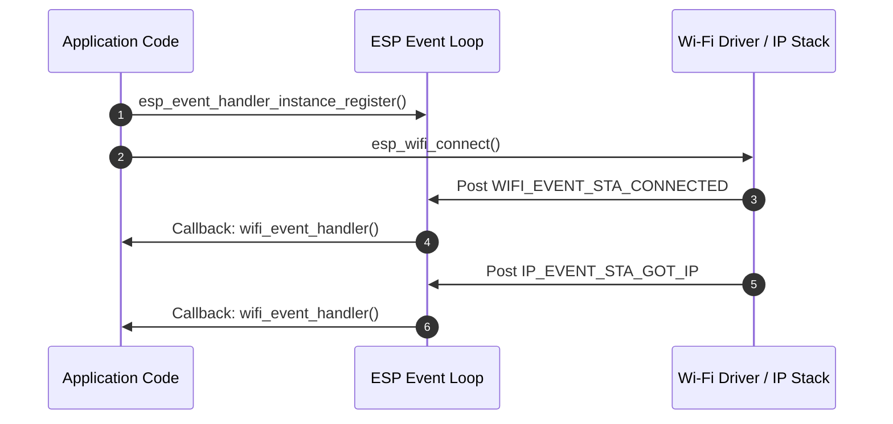
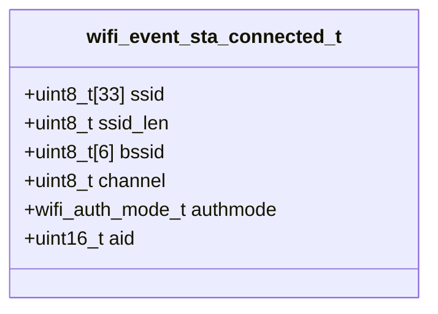
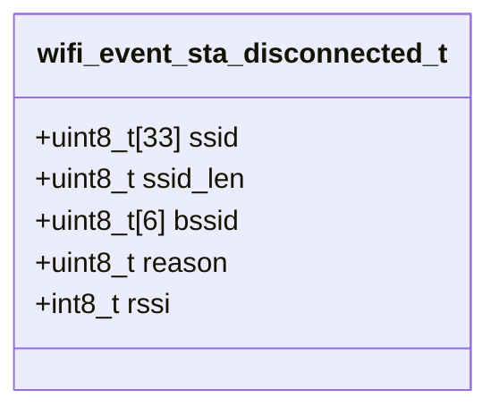
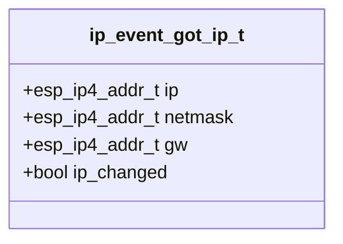

# ใบงานที่ 5.2: การยืนยันตัวตน การสถาปนาการเชื่อมต่อ และการรับหมายเลข IP Address (Wi-Fi Connection & IP Assignment)

## 0. กล่าวนำ (Introduction)
ใบงานนี้เป็นการทดลองต่อเนื่องจากใบงานที่ 5.1 (Scan Phase) เพื่อศึกษาและสังเกตกระบวนการสถาปนาการเชื่อมต่อแบบครบวงจรในเฟสที่ 2 (Authentication), เฟสที่ 3 (Association), เฟสที่ 4 (4-Way Handshake) และเฟสที่ 5 (IP Assignment / DHCP) ผ่านเฟรมเวิร์ก ESP-IDF 

นักศึกษาจะได้วิเคราะห์พฤติกรรมของระบบและอ่านค่า Log สไตล์ Forensic เมื่อเกิดเหตุการณ์เชื่อมต่อสำเร็จ (`WIFI_EVENT_STA_CONNECTED`, `IP_EVENT_STA_GOT_IP`) รวมถึงการตรวจสอบและถอดรหัส Disconnect Reason Code (`WIFI_EVENT_STA_DISCONNECTED`) เมื่อเกิดเหตุการณ์เชื่อมต่อล้มเหลว (เช่น SSID ผิด หรือ Password ผิด)

---

## 1. วัตถุประสงค์ (Objectives)
1. เรียนรู้กระบวนการเชื่อมต่อ Wi-Fi และการจัดสรรหมายเลข IP Address (DHCP Client) ในโหมด Station (`WIFI_STA`) บน ESP-IDF
2. เรียนรู้การใช้ Event Loop (`esp_event_handler_instance_register`) และ FreeRTOS Event Group ในการดักจับ Event ของระบบ Wi-Fi และ IP
3. อ่านและวิเคราะห์โครงสร้างข้อมูล Event ได้แก่ `wifi_event_sta_connected_t`, `wifi_event_sta_disconnected_t` และ `ip_event_got_ip_t`
4. ตรวจสอบและระบุสาเหตุของความล้มเหลวในการเชื่อมต่อ Wi-Fi จากค่า Disconnect Reason Code (เช่น `WIFI_REASON_NO_AP_FOUND` และ `WIFI_REASON_HANDSHAKE_TIMEOUT` / `AUTH_FAIL`)

---

## 2. อุปกรณ์และซอฟต์แวร์ที่ใช้ในการทดลอง (Equipment & Tools)
1. บอร์ดไมโครคอนโทรลเลอร์ ESP32 (เช่น ESP32 DevKit V1) จำนวน 1 บอร์ด
2. สายเชื่อมต่อ Micro-USB หรือ USB-C จำนวน 1 เส้น
3. คอมพิวเตอร์ที่ติดตั้งโปรแกรม IDE เช่น VS Code พร้อมทั้ง ESP-IDF (อาจจะติดตั้งบนเครื่องหรือบน Docker ก็ได้)

---

## 3. ความรู้พื้นฐานที่เกี่ยวข้อง (Theoretical Background - ESP-IDF Framework)

### 3.1 สถาปัตยกรรม Event Loop และ Event Handling ใน ESP-IDF
ใน ESP-IDF การทำงานของ Wi-Fi เป็นแบบ Asynchronous (ทำงานเบื้องหลัง) โดย Driver จะส่ง Event ผ่านระบบ **Default Event Loop** เพื่อแจ้งเตือนให้โปรแกรมทราบความคืบหน้า



### 3.2 โครงสร้างข้อมูล Event สำคัญ (Class Diagrams)

#### 1) โครงสร้างข้อมูล `wifi_event_sta_connected_t`
ส่งมาพร้อมกับ Event `WIFI_EVENT_STA_CONNECTED` เพื่อระบุรายละเอียดของ AP ที่เชื่อมต่อสำเร็จ:



#### 2) โครงสร้างข้อมูล `wifi_event_sta_disconnected_t`
ส่งมาพร้อมกับ Event `WIFI_EVENT_STA_DISCONNECTED` เพื่อระบุสาเหตุของการหลุดการเชื่อมต่อ:



#### 3) โครงสร้างข้อมูล `ip_event_got_ip_t`
ส่งมาพร้อมกับ Event `IP_EVENT_STA_GOT_IP` เมื่อ ESP32 ได้รับหมายเลข IP จาก DHCP Server:



---

## 4. ขั้นตอนและโปรแกรมทดสอบการทดลอง (Experimental Procedures)

ในใบงานนี้ จะทำการทดสอบการเชื่อมต่อ Wi-Fi ใน 3 สถานการณ์ย่อย เพื่อเปรียบเทียบ Forensic Log และ Disconnect Reason Code:

### 5.2.1 การเชื่อมต่อด้วย SSID และ Password ที่ถูกต้อง (Success Case)
กำหนดค่า SSID และ Password ที่ถูกต้องตามสภาพแวดล้อมจริง สังเกต Event `WIFI_EVENT_STA_CONNECTED` และ `IP_EVENT_STA_GOT_IP` พร้อมอ่านหมายเลข IP Address, Subnet Mask และ Gateway

### 5.2.2 การเชื่อมต่อด้วย SSID ที่ไม่มีอยู่จริง (Wrong SSID / No AP Found)
กำหนดค่า SSID สมมุติที่ไม่มีอยู่จริง (`"NON_EXISTENT_SSID_9999"`) สังเกต Event `WIFI_EVENT_STA_DISCONNECTED` และวิเคราะห์ค่า Reason Code ซึ่งต้องได้ `WIFI_REASON_NO_AP_FOUND` (Decimal 201 / Hex `0xC9`)

### 5.2.3 การเชื่อมต่อด้วย SSID ที่ถูกต้องแต่ Password ผิด (Wrong Password / Handshake Fail)
กำหนดค่า SSID ถูกต้องแต่ป้อน Password ผิด (`"WRONG_PASS_9999"`) สังเกต Event `WIFI_EVENT_STA_DISCONNECTED` ในขั้นตอน 4-Way Handshake และวิเคราะห์ค่า Reason Code ซึ่งต้องได้ `WIFI_REASON_HANDSHAKE_TIMEOUT` (15) หรือ `WIFI_REASON_AUTH_FAIL` (202 / 204)

---

## 5. ซอร์สโค้ดการทดลอง (Complete ESP-IDF Source Code - `main.c`)

ให้นักศึกษานำซอร์สโค้ด C ต่อไปนี้ไปวางในไฟล์ `main/main.c` ของโปรเจกต์ ESP-IDF ทำการ Build และ Flash ลงบอร์ด ESP32 จากนั้นเปิด ESP-IDF Monitor (Baud Rate `115200`) เพื่อสังเกตผลการทำงาน

==**หมายเหตุ** ใน source code ด้านล่าง  แนะนำให้ใช้ MY_SSID และ  MY_PASSWORD จาก mobile hotspot และต้องลบออกก่อน push ขึ้น git== 

```c
#include <stdio.h>
#include <string.h>
#include "freertos/FreeRTOS.h"
#include "freertos/task.h"
#include "freertos/event_groups.h"
#include "esp_system.h"
#include "esp_wifi.h"
#include "esp_event.h"
#include "esp_log.h"
#include "nvs_flash.h"
#include "esp_netif.h"

static const char *TAG = "LAB_WIFI_CONN";

/* FreeRTOS event group to signal when we are connected or failed */
static EventGroupHandle_t s_wifi_event_group;

#define WIFI_CONNECTED_BIT BIT0
#define WIFI_FAIL_BIT      BIT1

// Configurable target Wi-Fi credentials for successful test
#define EXAMPLE_ESP_WIFI_SSID      "MY_SSID"
#define EXAMPLE_ESP_WIFI_PASS      "MY_PASSWORD"

// Convert wifi_reason_code_t to readable string
static const char *get_disconnect_reason_name(uint8_t reason) {
  switch (reason) {
  case WIFI_REASON_UNSPECIFIED:
    return "WIFI_REASON_UNSPECIFIED (1)";
  case WIFI_REASON_AUTH_EXPIRE:
    return "WIFI_REASON_AUTH_EXPIRE (2)";
  case WIFI_REASON_AUTH_LEAVE:
    return "WIFI_REASON_AUTH_LEAVE (3)";
  case WIFI_REASON_ASSOC_EXPIRE:
    return "WIFI_REASON_ASSOC_EXPIRE (4)";
  case WIFI_REASON_ASSOC_FAIL:
    return "WIFI_REASON_ASSOC_FAIL (203)";
  case WIFI_REASON_NOT_AUTHED:
    return "WIFI_REASON_NOT_AUTHED (6)";
  case WIFI_REASON_HANDSHAKE_TIMEOUT:
    return "WIFI_REASON_HANDSHAKE_TIMEOUT (15)";
  case WIFI_REASON_NO_AP_FOUND:
    return "WIFI_REASON_NO_AP_FOUND (201)";
  case WIFI_REASON_AUTH_FAIL:
    return "WIFI_REASON_AUTH_FAIL (202)";
  case WIFI_REASON_4WAY_HANDSHAKE_TIMEOUT:
    return "WIFI_REASON_4WAY_HANDSHAKE_TIMEOUT (204)";
  case WIFI_REASON_CONNECTION_FAIL:
    return "WIFI_REASON_CONNECTION_FAIL (208)";
  case WIFI_REASON_BEACON_TIMEOUT:
    return "WIFI_REASON_BEACON_TIMEOUT (200)";
  default:
    return "OTHER_DISCONNECT_REASON";
  }
}

// Wi-Fi and IP Event Handler with Forensic Logging
static void wifi_event_handler(void *arg, esp_event_base_t event_base,
                               int32_t event_id, void *event_data) {
  if (event_base == WIFI_EVENT) {
    switch (event_id) {
    case WIFI_EVENT_STA_START:
      ESP_LOGI(TAG, "[EVENT FORENSIC]: WIFI_EVENT_STA_START received");
      ESP_LOGI(TAG, "[FORENSIC]: Call esp_wifi_connect()");
      esp_err_t err_conn = esp_wifi_connect();
      ESP_LOGI(TAG, "[FORENSIC]: esp_wifi_connect() returned %s (0x%x)",
               esp_err_to_name(err_conn), err_conn);
      break;

    case WIFI_EVENT_STA_CONNECTED: {
      wifi_event_sta_connected_t *event =
          (wifi_event_sta_connected_t *)event_data;
      ESP_LOGI(TAG, "=======================================================");
      ESP_LOGI(TAG, "[EVENT FORENSIC]: WIFI_EVENT_STA_CONNECTED received!");
      ESP_LOGI(TAG, "  -> Connected to SSID : %s", event->ssid);
      ESP_LOGI(TAG, "  -> BSSID            : %02X:%02X:%02X:%02X:%02X:%02X",
               event->bssid[0], event->bssid[1], event->bssid[2],
               event->bssid[3], event->bssid[4], event->bssid[5]);
      ESP_LOGI(TAG, "  -> Channel          : %d", event->channel);
      ESP_LOGI(TAG, "  -> Auth Mode        : %d", event->authmode);
      ESP_LOGI(TAG, "=======================================================");
      break;
    }

    case WIFI_EVENT_STA_DISCONNECTED: {
      wifi_event_sta_disconnected_t *event =
          (wifi_event_sta_disconnected_t *)event_data;
      ESP_LOGW(TAG, "=======================================================");
      ESP_LOGW(TAG, "[EVENT FORENSIC]: WIFI_EVENT_STA_DISCONNECTED received!");
      ESP_LOGW(TAG, "  -> Target SSID          : %s", event->ssid);
      ESP_LOGW(TAG, "  -> Reason Code (Decimal): %d", event->reason);
      ESP_LOGW(TAG, "  -> Reason Code (Hex)    : 0x%02X", event->reason);
      ESP_LOGW(TAG, "  -> Reason Description   : %s",
               get_disconnect_reason_name(event->reason));
      ESP_LOGW(TAG, "=======================================================");
      xEventGroupSetBits(s_wifi_event_group, WIFI_FAIL_BIT);
      break;
    }

    default:
      ESP_LOGI(TAG, "[EVENT FORENSIC]: WIFI_EVENT ID %ld received", event_id);
      break;
    }
  } else if (event_base == IP_EVENT) {
    if (event_id == IP_EVENT_STA_GOT_IP) {
      ip_event_got_ip_t *event = (ip_event_got_ip_t *)event_data;
      ESP_LOGI(TAG, "=======================================================");
      ESP_LOGI(TAG, "[EVENT FORENSIC]: IP_EVENT_STA_GOT_IP received!");
      ESP_LOGI(TAG, "  -> IP Address : " IPSTR, IP2STR(&event->ip_info.ip));
      ESP_LOGI(TAG, "  -> Netmask    : " IPSTR, IP2STR(&event->ip_info.netmask));
      ESP_LOGI(TAG, "  -> Gateway    : " IPSTR, IP2STR(&event->ip_info.gw));
      ESP_LOGI(TAG, "=======================================================");
      xEventGroupSetBits(s_wifi_event_group, WIFI_CONNECTED_BIT);
    }
  }
}

// Function to test Wi-Fi connection with specific config
static void test_wifi_connection(const char *test_title, const char *ssid,
                                  const char *password) {
  ESP_LOGI(TAG, "\n");
  ESP_LOGI(TAG, "------------------------------------------------------------------");
  ESP_LOGI(TAG, ">>> %s", test_title);
  ESP_LOGI(TAG, "------------------------------------------------------------------");
  ESP_LOGI(TAG, "  Target SSID: \"%s\"", ssid);
  ESP_LOGI(TAG, "  Target Password: \"%s\"", password);

  // Clear event bits
  xEventGroupClearBits(s_wifi_event_group, WIFI_CONNECTED_BIT | WIFI_FAIL_BIT);

  wifi_config_t wifi_config = {
      .sta = {
          .threshold.authmode = WIFI_AUTH_WPA2_PSK,
      },
  };
  strncpy((char *)wifi_config.sta.ssid, ssid, sizeof(wifi_config.sta.ssid));
  strncpy((char *)wifi_config.sta.password, password,
          sizeof(wifi_config.sta.password));

  ESP_LOGI(TAG, "[FORENSIC]: Call esp_wifi_stop()");
  esp_wifi_stop();

  ESP_LOGI(TAG, "[FORENSIC]: Call esp_wifi_set_config(WIFI_IF_STA, &wifi_config)");
  esp_err_t err_cfg = esp_wifi_set_config(WIFI_IF_STA, &wifi_config);
  ESP_LOGI(TAG, "[FORENSIC]: esp_wifi_set_config() returned %s (0x%x)",
           esp_err_to_name(err_cfg), err_cfg);

  ESP_LOGI(TAG, "[FORENSIC]: Call esp_wifi_start()");
  esp_err_t err_start = esp_wifi_start();
  ESP_LOGI(TAG, "[FORENSIC]: esp_wifi_start() returned %s (0x%x)",
           esp_err_to_name(err_start), err_start);

  /* Waiting until either the connection is established (WIFI_CONNECTED_BIT) or failed (WIFI_FAIL_BIT) */
  EventBits_t bits = xEventGroupWaitBits(s_wifi_event_group,
                                         WIFI_CONNECTED_BIT | WIFI_FAIL_BIT,
                                         pdFALSE, pdFALSE, pdMS_TO_TICKS(10000));

  if (bits & WIFI_CONNECTED_BIT) {
    ESP_LOGI(TAG, "[RESULT]: TEST PASSED - Connected to AP successfully!");
  } else if (bits & WIFI_FAIL_BIT) {
    ESP_LOGW(TAG, "[RESULT]: TEST FAILED - Disconnected event captured.");
  } else {
    ESP_LOGE(TAG, "[RESULT]: TEST TIMEOUT - Neither connected nor disconnected event received.");
  }
}

void app_main(void) {
  s_wifi_event_group = xEventGroupCreate();

  // 1. Initialize NVS Flash
  ESP_LOGI(TAG, "[FORENSIC]: Call nvs_flash_init()");
  esp_err_t ret = nvs_flash_init();
  ESP_LOGI(TAG, "[FORENSIC]: nvs_flash_init() returned %s (0x%x)",
           esp_err_to_name(ret), ret);
  if (ret == ESP_ERR_NVS_NO_FREE_PAGES ||
      ret == ESP_ERR_NVS_NEW_VERSION_FOUND) {
    ESP_LOGI(TAG, "[FORENSIC]: Call nvs_flash_erase()");
    ESP_ERROR_CHECK(nvs_flash_erase());
    ret = nvs_flash_init();
    ESP_LOGI(TAG, "[FORENSIC]: nvs_flash_init() retry returned %s (0x%x)",
             esp_err_to_name(ret), ret);
  }
  ESP_ERROR_CHECK(ret);

  // 2. Initialize Network Interface and Event Loop
  ESP_LOGI(TAG, "[FORENSIC]: Call esp_netif_init()");
  ESP_ERROR_CHECK(esp_netif_init());

  ESP_LOGI(TAG, "[FORENSIC]: Call esp_event_loop_create_default()");
  ESP_ERROR_CHECK(esp_event_loop_create_default());

  ESP_LOGI(TAG, "[FORENSIC]: Call esp_netif_create_default_wifi_sta()");
  esp_netif_t *sta_netif = esp_netif_create_default_wifi_sta();
  ESP_LOGI(TAG, "[FORENSIC]: esp_netif_create_default_wifi_sta() returned %p", sta_netif);

  // 3. Initialize Wi-Fi Driver
  wifi_init_config_t cfg = WIFI_INIT_CONFIG_DEFAULT();
  ESP_LOGI(TAG, "[FORENSIC]: Call esp_wifi_init(&cfg)");
  ESP_ERROR_CHECK(esp_wifi_init(&cfg));

  // 4. Register Event Handlers
  esp_event_handler_instance_t instance_any_id;
  esp_event_handler_instance_t instance_got_ip;
  ESP_LOGI(TAG, "[FORENSIC]: Call esp_event_handler_instance_register(WIFI_EVENT)");
  ESP_ERROR_CHECK(esp_event_handler_instance_register(
      WIFI_EVENT, ESP_EVENT_ANY_ID, &wifi_event_handler, NULL,
      &instance_any_id));

  ESP_LOGI(TAG, "[FORENSIC]: Call esp_event_handler_instance_register(IP_EVENT)");
  ESP_ERROR_CHECK(esp_event_handler_instance_register(
      IP_EVENT, IP_EVENT_STA_GOT_IP, &wifi_event_handler, NULL,
      &instance_got_ip));

  ESP_LOGI(TAG, "[FORENSIC]: Call esp_wifi_set_mode(WIFI_MODE_STA)");
  ESP_ERROR_CHECK(esp_wifi_set_mode(WIFI_MODE_STA));

  ESP_LOGI(TAG, "==================================================================");
  ESP_LOGI(TAG, "  Lab 5.2: Wi-Fi Connection & IP Assignment (ESP-IDF Forensic)");
  ESP_LOGI(TAG, "==================================================================");

  // ------------------------------------------------------------------
  // 5.2.1 Connecting with Correct SSID & Password (Success Case)
  // ------------------------------------------------------------------
  test_wifi_connection("Experiment 5.2.1: Connection Test - Correct Credentials",
                       EXAMPLE_ESP_WIFI_SSID, EXAMPLE_ESP_WIFI_PASS);

  vTaskDelay(pdMS_TO_TICKS(2000));

  // ------------------------------------------------------------------
  // 5.2.2 Connecting with Wrong SSID (Non-existent AP Case)
  // ------------------------------------------------------------------
  test_wifi_connection("Experiment 5.2.2: Connection Test - Wrong SSID (No AP Found)",
                       "NON_EXISTENT_SSID_9999", "12345678");

  vTaskDelay(pdMS_TO_TICKS(2000));

  // ------------------------------------------------------------------
  // 5.2.3 Connecting with Correct SSID but Wrong Password (Handshake Fail Case)
  // ------------------------------------------------------------------
  test_wifi_connection("Experiment 5.2.3: Connection Test - Wrong Password (Auth/Handshake Fail)",
                       EXAMPLE_ESP_WIFI_SSID, "WRONG_PASS_9999");

  ESP_LOGI(TAG, "==================================================================");
  ESP_LOGI(TAG, "  [Phase 2/3/4/5 Completed: Wi-Fi Connection Lab Finished]");
  ESP_LOGI(TAG, "==================================================================");
}
```

---

## 6. ตารางบันทึกผลการทดลอง (Experiment Results)

ให้นักศึกษาบันทึกผลลัพธ์จากการสังเกตใน Serial Console ลงในตารางต่อไปนี้:

### 6.1 ตารางสรุปเปรียบเทียบผลการทดลองทั้ง 3 สถานการณ์

| ข้อการทดลอง | สถานการณ์ทดสอบ | Event สุดท้ายที่ได้รับ | ผลลัพธ์ (Passed/Failed) | Reason Code (Decimal / Hex) | คำอธิบาย Reason Code |
| :---: | :--- | :---: | :---: | :---: | :--- |
| **5.2.1** | SSID และ Password ถูกต้อง | `IP_EVENT_STA_GOT_IP` | Passed | - | - (เชื่อมต่อสำเร็จ ไม่มี Error) |
| **5.2.2** | ระบุ SSID ผิด (ไม่มีในระบบ) | `WIFI_EVENT_STA_DISCONNECTED` | Failed | 201 / 0xC9 | `WIFI_REASON_NO_AP_FOUND` |
| **5.2.3** | ระบุ SSID ถูกต้อง แต่ Password ผิด | `WIFI_EVENT_STA_DISCONNECTED` | Failed | 2 / 0x02 | `WIFI_REASON_AUTH_EXPIRE` |

### 6.2 บันทึกข้อมูลเครือข่ายจากการเชื่อมต่อสำเร็จ (ข้อ 5.2.1)

| พารามิเตอร์เครือข่าย | ค่าที่ได้รับจริงจาก DHCP |
| :--- | :--- |
| **SSID** | BYTONOAK |
| **BSSID (MAC Address)** | 8A:AC:85:58:CA:D6 |
| **Channel** | 1 |
| **IP Address** | 172.20.10.2 |
| **Subnet Mask** | 255.255.255.240 |
| **Default Gateway** | 172.20.10.1 |

---

## 7. คำถามท้ายการทดลอง (Post-Lab Questions)

**1. เหตุใดการระบุ SSID ผิด (ข้อ 5.2.2) จึงส่งผลให้เกิด Disconnect Event ด้วย Reason Code `201` (`WIFI_REASON_NO_AP_FOUND`) ตั้งแต่เฟส Scan?**
* **ตอบ:** เพราะกระบวนการเชื่อมต่อเครือข่ายไร้สายเริ่มต้นด้วยเฟสการสแกนหาเป้าหมาย (Scan Phase) หาก SSID ที่ระบุไม่มีอยู่จริงในอากาศ บอร์ด ESP32 จะไม่พบ Access Point ที่ตรงกับเงื่อนไข ระบบจึงไม่สามารถเข้าสู่เฟสการยืนยันตัวตนได้ และยกเลิกการทำงานพร้อมรายงานรหัสข้อผิดพลาด `WIFI_REASON_NO_AP_FOUND` (201) ทันที

**2. เหตุใดการพิมพ์ Password ผิด (ข้อ 5.2.3) จึงผ่านเฟส Auth และ Assoc มาได้ แต่มาล้มเหลวในเฟส 4-Way Handshake (Reason Code `15`, `204` หรือ `2` ในบางกรณีเช่น iOS Hotspot)?**
* **ตอบ:** ในมาตรฐานความปลอดภัย WPA2 การยืนยันตัวตนในเลเยอร์เชื่อมโยงข้อมูล (Data Link Layer) จะเปิดกว้างในตอนแรก ทำให้บอร์ดสามารถผ่านเฟส Authentication และ Association สำเร็จ แต่การตรวจสอบความถูกต้องของรหัสผ่านที่แท้จริงจะเกิดขึ้นในขั้นตอน 4-Way Handshake ซึ่งต้องใช้รหัสผ่าน (PMK) มาเข้ารหัสคีย์ความปลอดภัย หากรหัสผ่านไม่ถูกต้อง การแลกเปลี่ยนข้อความจึงล้มเหลวและเกิด Timeout หรือ Auth Expire ในขั้นตอนนี้นั่นเอง

**3. ลำดับการเกิด Event ระหว่าง **`WIFI_EVENT_STA_CONNECTED`** กับ **`IP_EVENT_STA_GOT_IP`** Event ใดเกิดขึ้นก่อนกัน และมีความหมายทางกายภาพของ Layer Network ต่างกันอย่างไร?**
* **ตอบ:** 
  * **ลำดับการเกิด:** `WIFI_EVENT_STA_CONNECTED` จะเกิดขึ้นก่อน `IP_EVENT_STA_GOT_IP` เสมอ
  * **ความหมายทางเลเยอร์:** 
    * `WIFI_EVENT_STA_CONNECTED` เกี่ยวข้องกับ **Data Link Layer (Layer 2)** หมายถึงการเชื่อมต่อทางวิทยุและ MAC Address ระหว่าง ESP32 กับ Access Point สำเร็จแล้ว
    * `IP_EVENT_STA_GOT_IP` เกี่ยวข้องกับ **Network Layer (Layer 3)** หมายถึงการสื่อสารระดับไอพีและการได้รับหมายเลข IP Address จาก DHCP Server เรียบร้อยแล้ว ทำให้พร้อมรับ-ส่งข้อมูลบนเครือข่าย

**4. สมาชิกตัวแปร `reason` ในโครงสร้าง `wifi_event_sta_disconnected_t` มีประโยชน์อย่างไรต่อการออกแบบระบบค้นหาสาเหตุและกู้คืนการเชื่อมต่อ (Auto-Reconnection Mechanism) ในแอปพลิเคชัน IoT?**
* **ตอบ:** ช่วยให้โปรแกรมสามารถแยกแยะสาเหตุของปัญหาและตอบสนองได้อย่างฉลาด (Smart Recovery) เช่น หากพบว่าเป็นข้อผิดพลาดเรื่องฮาร์ดแวร์หรือเร้าเตอร์ปิดตัว (`NO_AP_FOUND`) ระบบอาจจะเว้นระยะเวลาในการลองเชื่อมต่อใหม่ให้ยาวขึ้นเพื่อประหยัดพลังงาน แต่หากเป็นปัญหาเรื่องรหัสผ่านไม่ถูกต้อง ระบบสามารถหยุดความพยายามเชื่อมต่อและแจ้งเตือนผู้ใช้ให้กำหนดค่าใหม่ได้ทันที
